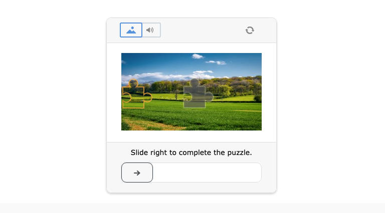
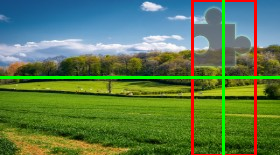
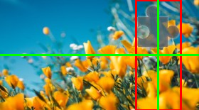
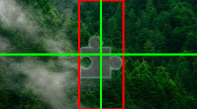

# Datadome-GeeTest-Captcha-Solver
Datadome-GeeTest-Captcha-Solver is a Python tool designed for identifying the position of puzzles in Datadome's GeeTest Captchas. This tool employs advanced image processing techniques to analyze captcha images and find the correct position for the puzzle piece. This README provides an initial guide and example of how to use the tool. For a comprehensive understanding and theory behind the solution, readers are encouraged to visit the [accompanying Medium article](https://medium.com/@glizzykingdreko/solving-geetest-captcha-automating-with-python-against-datadomes-claims-b3309c5119b0).



[]

**Disclaimer** You'll only calculate the position of the missing puzzle using this repo, the automatization/solving part stays up to you :D

## Table of Contents
- [Datadome-GeeTest-Captcha-Solver](#datadome-geetest-captcha-solver)
  - [Table of Contents](#table-of-contents)
  - [Installation](#installation)
  - [Usage](#usage)
    - [Example:](#example)
    - [Running a test](#running-a-test)
    - [Debugging](#debugging)
  - [Contributing](#contributing)
  - [Learn More](#learn-more)
  - [License](#license)
  - [My links](#my-links)


## Installation
To use Datadome-GeeTest-Captcha-Solver, you need to have Python installed on your system along with several dependencies:
- numpy
- Pillow (PIL)
- BeautifulSoup
- OpenCV (cv2)
- io
- requests

You can install these dependencies using pip:
```bash
pip install numpy pillow bs4 opencv-python requests
```

## Usage
To use this tool, follow these steps:
1. Import the `GeeTestIdentifier` class from the solver script.
2. Create an instance of `GeeTestIdentifier` by passing the background and puzzle piece images.
3. Use the provided methods to analyze the captcha and find the puzzle position.

### Example:
```python
from solver import GeeTestIdentifier

# Example usage
identifier = GeeTestIdentifier(background_image_path, puzzle_piece_image_path)
position = identifier.find_puzzle_position()
print("Puzzle position:", position)
```

### Running a test
```python
from solver import GeeTestIdentifier

GeeTestIdentifier.test()
```

### Debugging
By pussing the `debugger` parameter to the `GeeTestIdentifier` constructor, you can enable debugging mode. This will save to `output.png` an image of the puzzle piece with the identified position highlighted in red with the axis for the pixel calculations.

Here's some examples of the output:

     


## Contributing
Contributions to the
Contributions to the Datadome-GeeTest-Captcha-Solver are welcome. Please feel free to fork the repository, make changes, and submit a pull request. For major changes, please open an issue first to discuss what you would like to change.

## Learn More
For a more detailed explanation and theory behind solving GeeTest Captchas, please read the accompanying Medium article. The article provides insights into the techniques and methodologies used in this tool.

## License
This project is licensed under the MIT License - see the [LICENSE](./LICENSE) file for details.

## My links
- [Website](https://glizzykingdreko.github.io)
- [GitHub](https://github.com/glizzykingdreko)
- [Twitter](https://mobile.twitter.com/glizzykingdreko)
- [Medium](https://medium.com/@glizzykingdreko)
- [Email](mailto:glizzykingdreko@protonmail.com) 
- [Buy me a coffee ❤️](https://www.buymeacoffee.com/glizzykingdreko)
- [Medium Article](https://medium.com/@glizzykingdreko/solving-geetest-captcha-automating-with-python-against-datadomes-claims-b3309c5119b0)